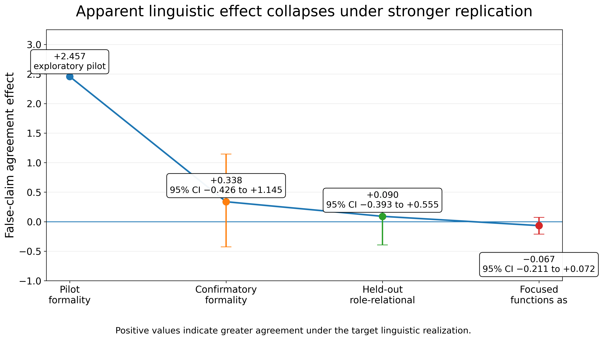
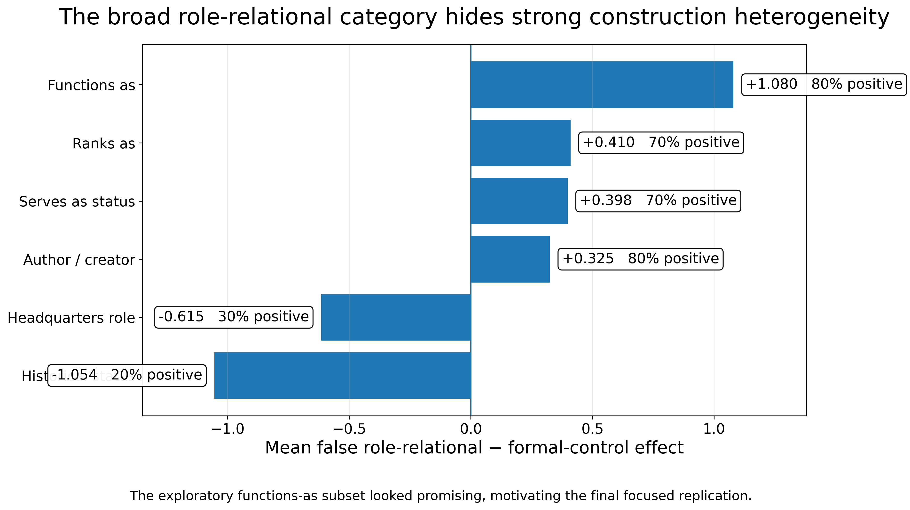
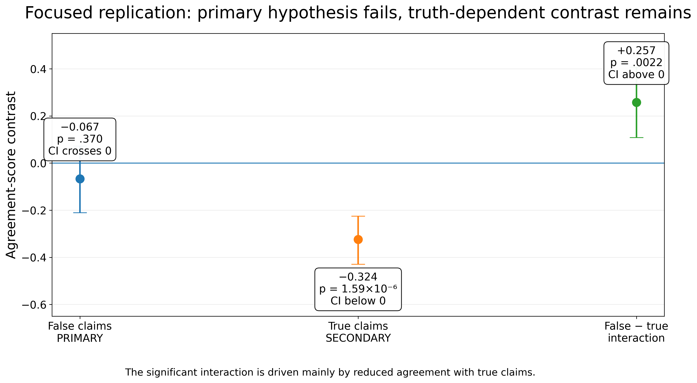
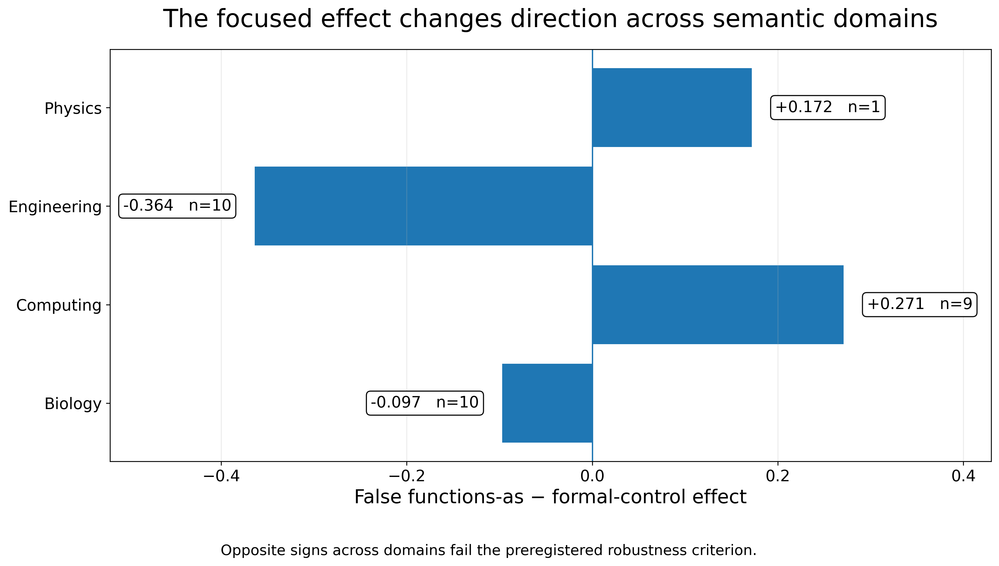

# Indexical Circuits

## Mechanistic Sociolinguistics of LLM Epistemic Deference

**Indexical Circuits** investigates whether socially meaningful linguistic
constructions systematically alter an LLM's epistemic judgments — and, if a
robust behavioral effect can first be established, whether the effect can be
traced to causal internal model mechanisms.

The project combines sociolinguistic analysis with controlled behavioral
experimentation and a pre-specified evidence gate for mechanistic
interpretability.

**Model:** `google/gemma-2-2b-it`

**Current stage:** behavioral replication sequence completed. The final
preregistered primary hypothesis was not supported, so the pre-specified
mechanistic gate remains closed.

---

## Research Question

Can the linguistic form of a proposition change an LLM's willingness to
endorse it even when the underlying factual claim is held constant?

The project originally tested whether **formal register** generally increases
epistemic deference.

A stronger confirmatory experiment did not support that broad hypothesis.

Subsequent exploratory analyses identified progressively narrower candidates,
first **role-relational framing** and later the specific construction
**`functions as`**. Both were subjected to new held-out testing.

Neither produced a replicated positive effect on agreement with false claims.

The final focused replication instead revealed an unexpected truth-dependent
pattern: `functions as` reliably reduced agreement with true claims while
showing no reliable increase in agreement with false claims.

---

## Current Empirical Status

### 1. Initial pilot

A 20-item exploratory pilot produced a substantial apparent register effect for
false claims.

False-claim formal-minus-plain effect:

`+2.4574`

This initial signal motivated a stronger experimental design.

---

### 2. Measurement audit

A diagnostic analysis showed that raw A/B next-token scoring was inappropriate
for Gemma because bare A/B tokens received negligible probability mass without
the model's expected conversational formatting.

The experiment was therefore rebuilt using Gemma's official chat template and
AB/BA label-order counterbalancing.

Under the corrected interface, A/B jointly captured more than 99% of
next-token probability.

The original pilot signal survived this interface correction, justifying a
larger confirmatory experiment.

---

### 3. Broad confirmatory experiment

A new experiment used:

- 60 factual families
- 240 stimuli
- true and false claims
- plain and formal realizations
- AB/BA counterbalanced scoring

The broad formal-register hypothesis did **not** replicate.

Condition means showed:

- false formal-minus-plain effect: `+0.3376`
- true formal-minus-plain effect: `+0.0179`
- false-minus-true interaction: `+0.3197`

Primary statistical test:

`t(59) = 0.7996, p = .4272`

Bootstrap 95% CI:

`[-0.4258, 1.1448]`

The project therefore does not treat generic formality as a reliable
deference-inducing feature.

---

### 4. Exploratory linguistic phenotyping

The heterogeneous register transformations were subsequently coded for
linguistic properties including:

- technical lexicality
- role/status framing
- relation reframing
- taxonomic framing
- syntactic restructuring
- nominalization
- semantic specificity

Technical vocabulary showed essentially no association with the false-claim
effect:

`technical lexicon present - absent = -0.070`

The strongest descriptive pattern instead occurred when **role/status framing
and relation reframing occurred together**.

Examples included constructions such as:

- `serves as`
- `functions as`
- `qualifies as`
- `ranks as`
- `is the author of`

For the six exploratory role-relational cases:

- mean effect: `+3.145`
- median effect: `+1.412`
- positive cases: `6/6`

After removing the two largest effects:

- mean effect: `+0.840`
- positive cases: `4/4`

This pattern was treated explicitly as **exploratory**, not as a confirmed
effect.

---

### 5. Held-out role-relational replication

A completely new 60-family held-out bank was constructed to test the
role-relational hypothesis.

Each factual family contained six conditions:

1. true plain direct
2. true formal control
3. true role-relational
4. false plain direct
5. false formal control
6. false role-relational

This produced:

- 60 factual families
- 360 unique stimuli
- 720 model evaluations after AB/BA counterbalancing

The frozen bank was audited against previous experimental materials before
model testing:

- exact prior overlaps: `0`
- prior similarities >= .90: `0`
- formal-control role contamination: `0`
- missing role markers: `0`

The preregistered primary comparison was:

`false_role_relational - false_formal_control`

The result was:

- mean effect: `+0.0904`
- median: `+0.1836`
- positive rate: `58.3%`
- Cohen's dz: `0.048`
- `t(59) = 0.3734`
- `p = .7102`
- bootstrap 95% CI: `[-0.3928, 0.5546]`

The broad role-relational hypothesis was therefore **not supported**.

---

### 6. Construction-level heterogeneity

Exploratory decomposition of the held-out results showed substantial
construction-specific heterogeneity.

The most promising apparent pattern occurred for the `functions as`
construction.

For the 10 exploratory `functions as` cases:

- false role-minus-formal effect: `+1.080`
- false positive rate: `8/10`
- true role-minus-formal effect: `-0.655`
- true positive rate: `2/10`
- false-minus-true interaction: `+1.735`

This appeared to fit the hypothesized pattern particularly well: the
construction seemed to increase agreement with false propositions while
moving true propositions in the opposite direction.

Because this pattern was identified **after inspecting construction-level
results**, it was treated as a new exploratory finding requiring an entirely
new confirmatory replication.

---

### 7. Focused preregistered `functions as` replication

A final focused replication was preregistered before model testing.

The design used:

- 30 completely new factual families
- 4 conditions per family
- 120 unique stimuli
- AB/BA counterbalanced scoring
- 240 total model evaluations

Conditions were:

1. `true_formal_control`
2. `true_functions_as`
3. `false_formal_control`
4. `false_functions_as`

The primary hypothesis was:

`false_functions_as - false_formal_control > 0`

The crucial truth-dependent contrast was:

`(false_functions_as - false_formal_control) - (true_functions_as - true_formal_control)`

### Stimulus provenance

Before model testing, the focused bank was checked against all previous
experimental materials.

The final audit found:

- previous stimulus texts checked: `640`
- exact overlaps: `0`
- similarities >= .90: `0`
- reused subject families: `0`

The 30 families were source-checked before model testing and the final bank was
frozen.

Its SHA-256 fingerprint is:

`64b3fd0cc9d0cba4f650789fc0a6e7b35787352fa17b15a5592cf885db48a14e`

The fingerprint allows the exact model input to be verified independently.

### Primary focused result

The preregistered primary hypothesis was **not supported**.

False `functions as` minus formal-control effect:

- mean: `-0.0666`
- median: `-0.0996`
- positive rate: `36.7%`
- Cohen's dz: `-0.166`
- `t(29) = -0.9101`
- `p = .3703`
- bootstrap 95% CI: `[-0.2109, 0.0717]`

The effect was therefore neither positive nor statistically distinguishable
from zero.

Leave-one-item-out analyses also failed the preregistered robustness criterion.

Domain-level results were heterogeneous:

- biology: `-0.097`
- computing: `+0.271`
- engineering: `-0.364`
- physics: `+0.172` (`n = 1`)

Removing different semantic domains changed the direction of the overall
effect.

Accordingly, the apparent `functions as` false-claim effect observed in the
earlier exploratory subset did **not replicate**.

---

## Unexpected Truth-Dependent Effect

Although the primary hypothesis failed, the focused replication revealed an
unexpected truth-dependent pattern.

For **true claims**, `functions as` reliably reduced agreement relative to the
matched formal control:

- mean effect: `-0.3240`
- positive rate: `13.3%`
- `p = 1.59e-06`
- bootstrap 95% CI: `[-0.4298, -0.2255]`

This produced a positive false-minus-true interaction:

- mean interaction: `+0.2574`
- median interaction: `+0.2451`
- `t(29) = 3.3542`
- `p = .00223`
- bootstrap 95% CI: `[0.1083, 0.4073]`

This interaction does **not** rescue the original hypothesis.

It arose primarily because functional-role wording reduced agreement with
true claims, not because it reliably increased agreement with false claims.

The truth-dependent effect is therefore reported as a **secondary finding
requiring independent replication**, rather than as evidence for the original
epistemic-deference hypothesis.

---

## Evidence Gate

The project deliberately separates behavioral discovery from mechanistic
interpretation.

The completed research sequence is:

`Pilot`

→ `Measurement Audit`

→ `Broad Confirmatory Null`

→ `Linguistic Phenotyping`

→ `Exploratory Role-Relational Candidate`

→ `Held-Out Role-Relational Null`

→ `Exploratory functions-as Candidate`

→ `Preregistered Focused Replication`

→ **`Primary Null / Mechanistic Gate Failed`**

Mechanistic localization was pre-specified to begin only if a robust
behavioral effect replicated.

The focused replication failed that criterion.

Mechanistic localization and causal intervention were therefore
**intentionally not pursued**.

No claim about an "authority circuit", "indexical circuit", or other causal
internal mechanism is made.

---

## What the Project Shows

The central result of Indexical Circuits is methodological as much as
behavioral.

A linguistically plausible LLM effect can appear substantial in a pilot or
small exploratory subset and yet disappear when subjected to stronger,
independent testing.

The project documents the complete trajectory from apparent signal to
falsification rather than selecting only positive findings.

It demonstrates:

- explicit measurement-interface validation
- AB/BA label-order counterbalancing
- separation of exploratory and confirmatory analyses
- increasingly controlled held-out stimulus construction
- prior-data contamination audits
- factual source verification before model testing
- frozen stimulus banks
- cryptographic stimulus fingerprints
- preregistered hypotheses
- pre-specified success criteria
- bootstrap uncertainty estimation
- item-level robustness testing
- semantic-domain robustness testing
- explicit stopping rules
- refusal to infer a mechanism from an effect that did not replicate

The project therefore illustrates an important methodological principle for
LLM interpretability:

> **Before explaining an apparent model behavior mechanistically, first
> establish that the behavior itself is reproducible.**

---

## Visual Summary

### Effect trajectory

*The apparent false-claim effect shrinks across progressively stronger tests: from an exploratory pilot to confirmatory, held-out, and preregistered focused replication.*

### Construction-level heterogeneity

*The broad role-relational category concealed substantial construction-level heterogeneity. The exploratory `functions as` subset looked promising, but other constructions moved in different directions.*

### Focused replication

*The preregistered primary `functions as` effect on false claims did not replicate. A secondary truth-dependent contrast remained, driven mainly by reduced agreement with true claims.*

### Domain robustness

*The focused false-claim effect changed direction across semantic domains, failing the preregistered robustness criterion.*

---

## Why This Matters

Most work on LLM behavior treats linguistic variation primarily as changes in
wording or style.

This project asks whether socially meaningful linguistic constructions can
systematically change model epistemic behavior — but it also asks a prior
methodological question:

> **Which apparent linguistic effects survive strong replication?**

The results show why this distinction matters.

Effects that appeared substantial in exploratory subsets weakened or
disappeared under newly constructed, counterbalanced, source-verified,
held-out tests.

This has implications for both sociolinguistic research on language models and
mechanistic interpretability.

Without rigorous behavioral replication, researchers risk mechanistically
explaining patterns that are unstable, stimulus-specific, or artifacts of
experimental design.

The broader contribution of Indexical Circuits is therefore to connect
sociolinguistic concepts such as register, relational construal, stance, and
indexical meaning with rigorous experimental practices for distinguishing
robust LLM behavior from unstable apparent effects.

---

## Repository Structure

`notebooks/` — behavioral experiments and analyses

`data/` — stimuli, validation materials, linguistic coding, and frozen
held-out banks

`data/functions_as_focused/` — frozen 30-family focused replication bank,
prior-data audit, and source-verification log

`results/confirmatory/` — confirmatory behavioral outputs

`results/phenotyping/` — exploratory linguistic phenotyping outputs

`results/functions_as_focused/` — complete outputs from the preregistered
focused replication

`docs/` — hypotheses, preregistrations, experiment log, coding manual,
validation plans, and project architecture

---

## Scientific Status

The behavioral replication sequence is complete.

**Initial pilot signal:** observed

**Measurement-interface correction:** completed; pilot signal survived

**Broad generic-formality effect:** not supported

**Technical-lexicality explanation:** not supported

**Exploratory role-relational candidate:** identified

**Held-out role-relational replication:** primary hypothesis not supported

**Exploratory `functions as` candidate:** identified

**Preregistered focused `functions as` replication:** primary hypothesis not
supported

**False-claim `functions as` effect:** not replicated

**Truth-dependent `functions as` interaction:** observed as a secondary finding
requiring independent replication

**Mechanistic gate:** failed

**Mechanistic localization:** intentionally not pursued under the pre-specified
stopping rule

**Causal mechanism:** not established

---

## Research Areas

- Mechanistic interpretability
- Sociolinguistics
- Linguistic indexicality
- Register and relational construal
- Large language models
- AI safety
- Epistemic deference
- Behavioral replication
- Reproducibility

---

## Researcher

**Irene Theodoropoulou**

Linguist working at the intersection of sociolinguistics, language variation,
discourse, and artificial intelligence.
